<p align="center">
  
</p>

<h1 align="center">Ghostwire Proxy</h1>

<p align="center">
  A modern, self-hosted reverse proxy manager with built-in security — an alternative to Nginx Proxy Manager.
</p>

<p align="center">
  
  
  
  
  
</p>

---

## What is Ghostwire Proxy?

Ghostwire Proxy is a full-featured reverse proxy management platform that combines the simplicity of Nginx Proxy Manager with enterprise-grade security features. It runs as a Docker stack and provides a clean web UI for managing proxy hosts, SSL certificates, authentication walls, firewall integrations, and more.

It is a standalone subproject within the [Ghostwire](https://github.com/garethcheyne/ghostwire) ecosystem — fully independent, but designed to integrate when needed.

---

## Features

### Reverse Proxy Management
- Create and manage proxy hosts with a clean dashboard
- Forward HTTP/HTTPS traffic to upstream services
- WebSocket support, HTTP/2, and HSTS
- Custom nginx advanced configuration per host
- Live config generation and OpenResty hot-reload (zero downtime)

### SSL / TLS Certificates
- **Let's Encrypt** automatic issuance and renewal via Certbot
- Manual certificate upload (custom CA, self-signed)
- DNS challenge support via Cloudflare
- Per-host SSL configuration (force HTTPS, HTTP/2)

### Authentication Wall
- Protect any proxied service with a login gate
- **Local auth** — username/password per auth wall
- **TOTP** — time-based one-time password (2FA)
- Customizable auth portal UI (Vite + React)

### Web Application Firewall (WAF)
- Lua-based request inspection at the proxy layer
- Detection rules for SQL injection, XSS, path traversal, RCE, and scanner fingerprints
- Configurable actions per rule: log, block, or blocklist
- Per-host WAF enable/disable

### Threat Response & Automated Firewall Blocking
- Tiered response system: warn → temp block → permanent block → **firewall ban**
- IP reputation tracking with cumulative threat scores
- Automatic or manual escalation — when a threat score crosses your threshold, the IP gets pushed to your firewall
- Temporary and permanent bans with configurable expiry
- Push malicious IPs directly to your network firewall:
  - **Ubiquiti UniFi** — creates firewall rules via the UniFi Controller API _(tested)_
  - **MikroTik RouterOS** — adds IPs to address lists _(implemented, untested)_
  - **pfSense / OPNsense** — _(planned)_
- Blocklist sync status tracking — see which IPs have been pushed, pending, or expired
- Blocks at the **network edge**, not just at the proxy — attackers are dropped before they even reach your services

### GeoIP Blocking
- Country-level allow/deny lists per proxy host
- GeoIP database support (MaxMind GeoLite2)

### Rate Limiting
- Configurable per-host rate limits
- In-memory tracking via Lua shared dictionaries

### Access Lists
- IP whitelist / blacklist groups
- Assign access lists to proxy hosts

### Traffic & Analytics
- Per-request logging (optional per host)
- Dashboard with request counts, bandwidth, response times
- Traffic over time, status code breakdown
- Per-host analytics

### Alerts & Notifications
- Real-time alerts for security events
- Configurable alert channels (webhook, email)
- Alert severity levels and filtering

### System & Administration
- Multi-user admin with JWT authentication
- Audit logging for all admin actions
- Backup and restore
- System health monitoring
- DNS provider management (Cloudflare integration)

### Firewall Connector Management
- Add and configure multiple firewall connectors from the admin UI
- Test connectivity before saving
- View sync status and last push time per connector
- Manage the blocklist — see all IPs currently blocked at the firewall level
- Remove or expire individual entries

### Mobile Ready
- PWA support — installable on mobile devices
- Responsive, mobile-first dark UI
- Built with Tailwind CSS and shadcn/ui

---

## Screenshots

<details>
<summary><strong>Dashboard</strong></summary>
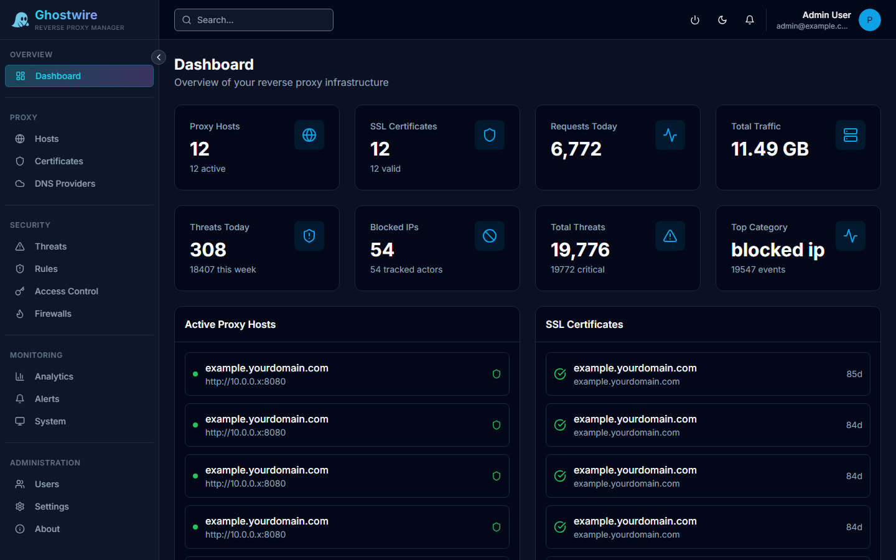
</details>

<details>
<summary><strong>Proxy Hosts</strong></summary>
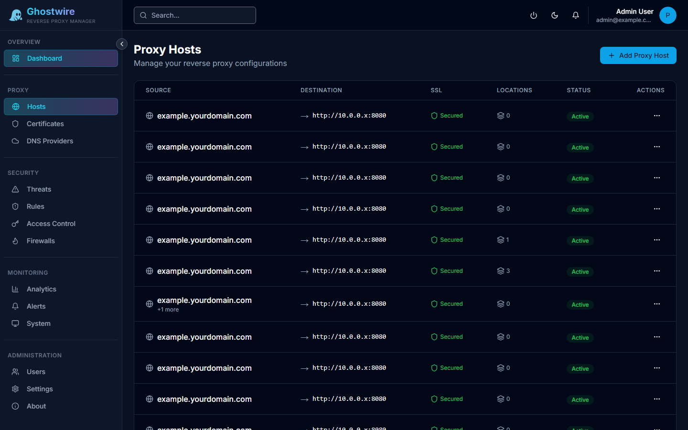
</details>

<details>
<summary><strong>SSL Certificates</strong></summary>
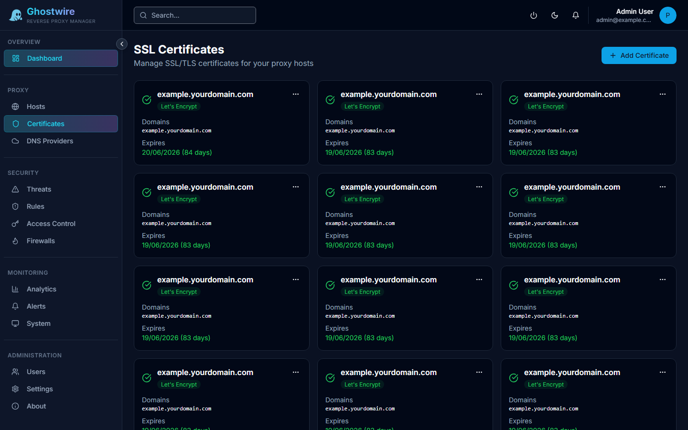
</details>

<details>
<summary><strong>Threat Detection & Response</strong></summary>
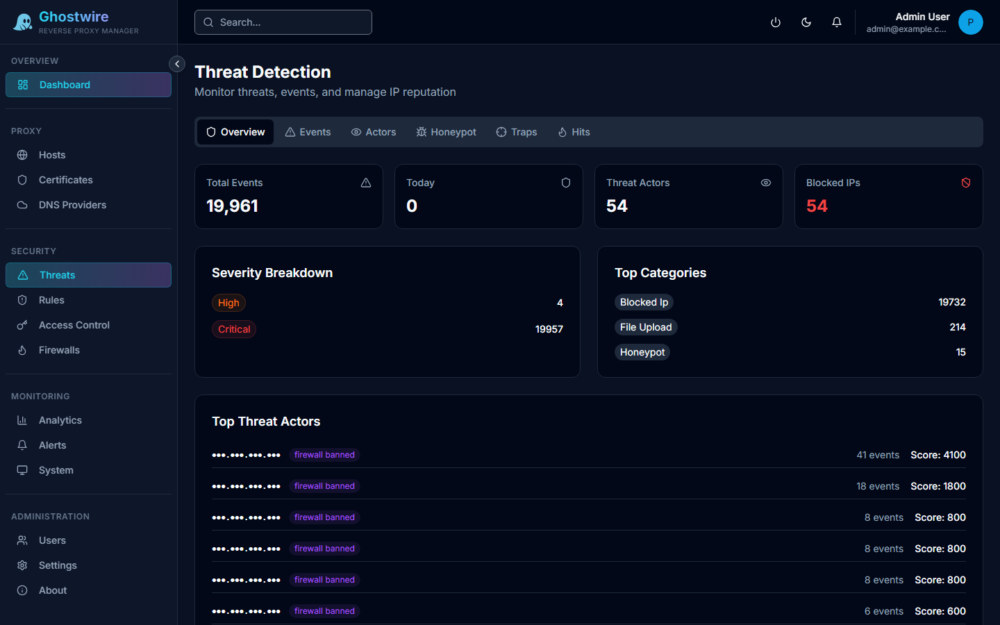
</details>

<details>
<summary><strong>Honeypot Traps</strong></summary>

</details>

<details>
<summary><strong>Security Rules (WAF, GeoIP, Rate Limits)</strong></summary>
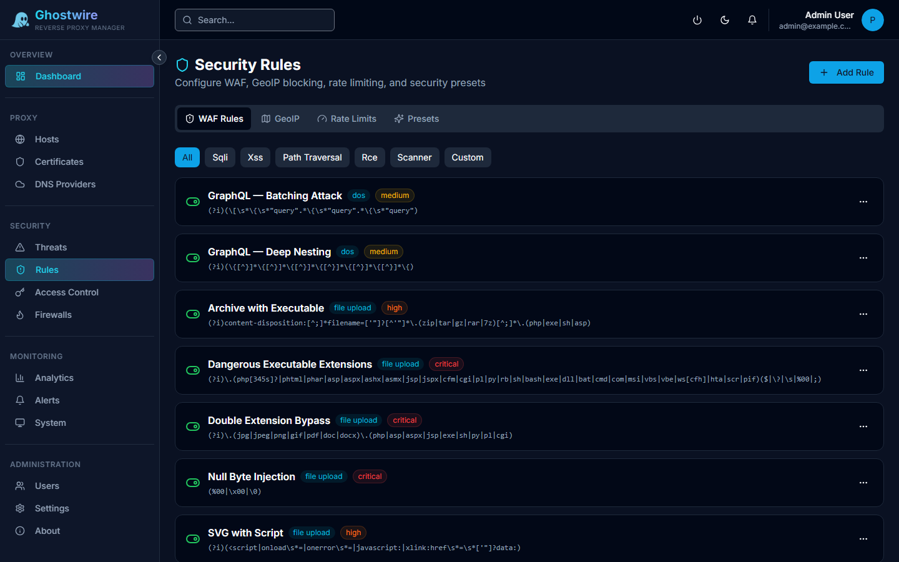
</details>

<details>
<summary><strong>GeoIP Blocking</strong></summary>

</details>

<details>
<summary><strong>Access Control (Auth Walls & IP Lists)</strong></summary>
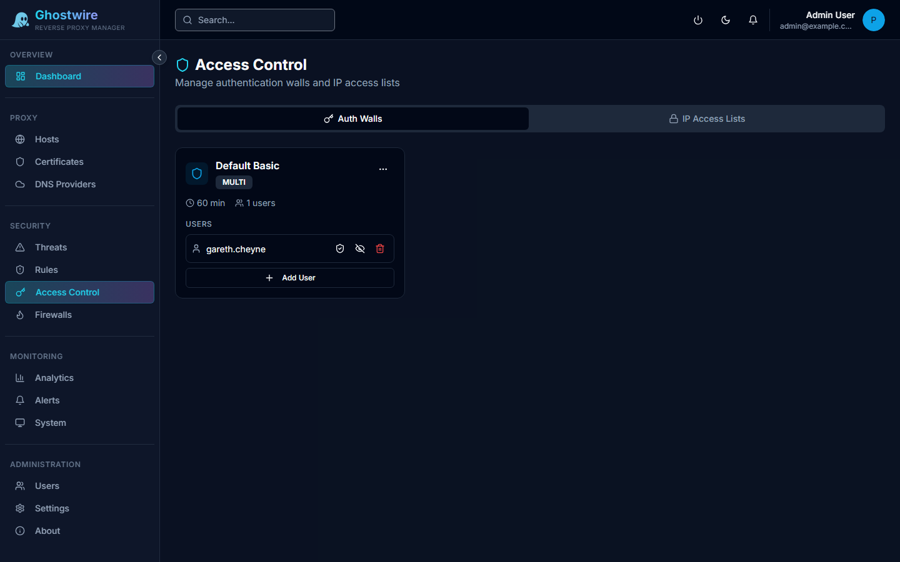
</details>

<details>
<summary><strong>Firewall Integration</strong></summary>
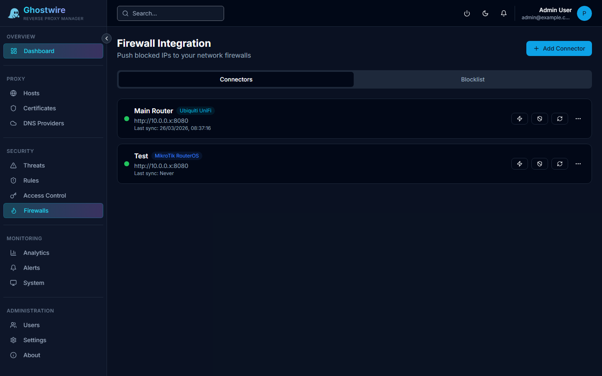
</details>

<details>
<summary><strong>Analytics</strong></summary>
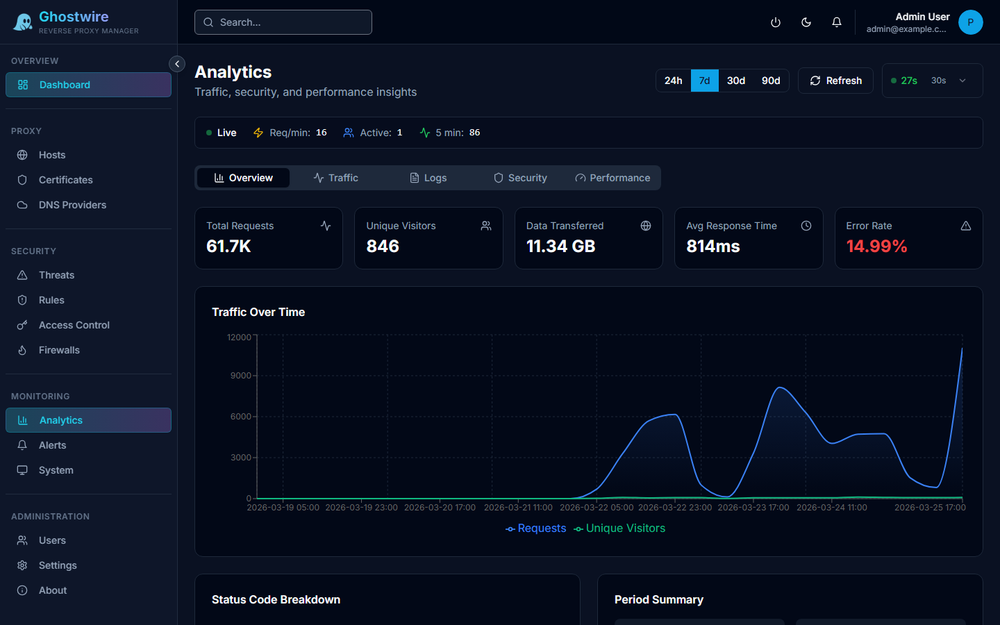
</details>

<details>
<summary><strong>Traffic Logs (within Analytics)</strong></summary>
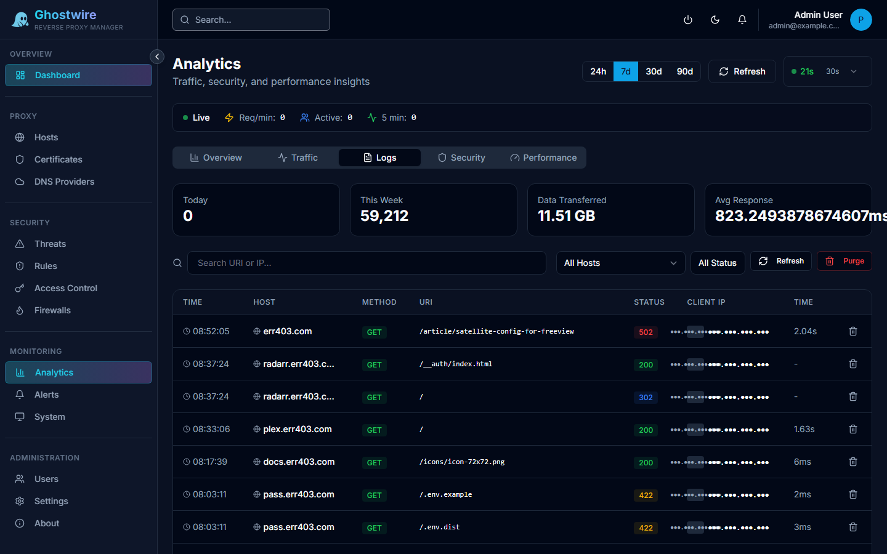
</details>

<details>
<summary><strong>Threat Origin Heatmap</strong></summary>

</details>

<details>
<summary><strong>System Monitoring</strong></summary>
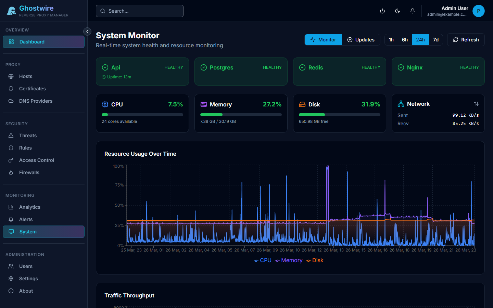
</details>

<details>
<summary><strong>Settings</strong></summary>
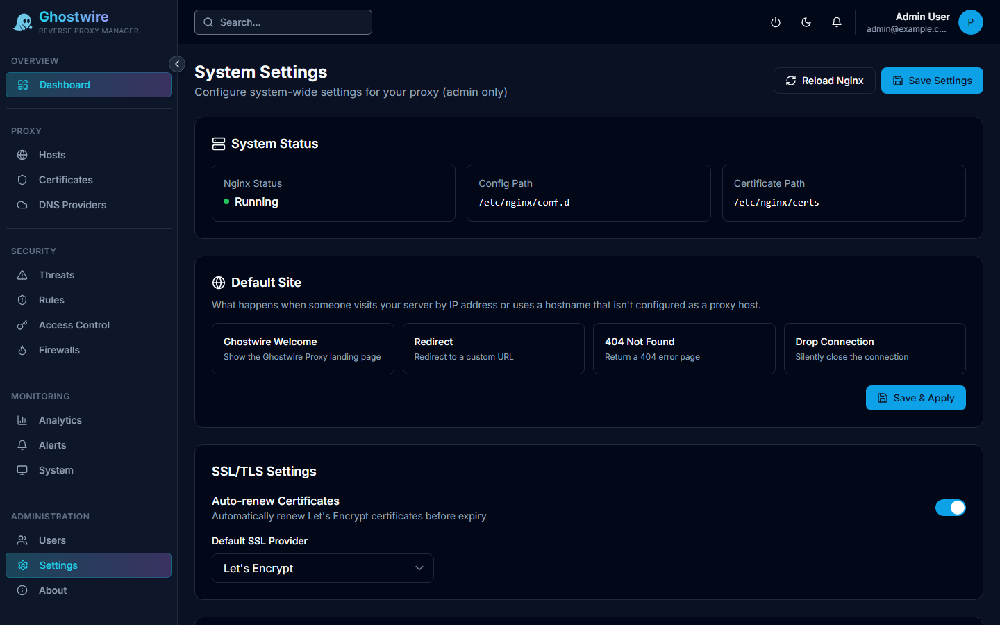
</details>

<details>
<summary><strong>About (License & Updates)</strong></summary>

</details>

---

## Tech Stack

| Layer | Technology |
|-------|-----------|
| **Proxy Engine** | OpenResty (Nginx + Lua) on Alpine |
| **Frontend** | Next.js 16+, TypeScript, Tailwind CSS, shadcn/ui |
| **Backend API** | Python 3.12, FastAPI, SQLAlchemy |
| **Database** | PostgreSQL 16 (via asyncpg) |
| **Auth** | JWT, TOTP |
| **Containers** | Docker Compose |

---

## Quick Start

### Prerequisites
- Docker & Docker Compose
- A domain pointed to your server (for SSL)

### 1. Clone

```bash
git clone https://github.com/garethcheyne/ghostwire-proxy.git
cd ghostwire-proxy
```

### 2. Configure

```bash
cp .env.example .env
# Edit .env with your settings (database password, domain, secrets)
```

### 3. Run

```bash
docker compose up -d
```

### 4. Access

| Service | URL |
|---------|-----|
| **Admin UI** | `http://your-server:88` |
| **API** | `http://your-server:8089` |
| **Proxy HTTP** | Port `80` |
| **Proxy HTTPS** | Port `443` |

On first launch, you'll be guided through initial setup to create your admin account.

---

## Upgrading

### Automatic (recommended)

Run the included upgrade script from your project directory:

```bash
./scripts/upgrade.sh            # upgrade to latest tagged release
./scripts/upgrade.sh v2026.04.05.1200  # upgrade to a specific version
```

The script will:
1. **Back up** your database (`data/backups/pre-upgrade-*.sql`)
2. **Pull** the new version via git
3. **Build** new container images
4. **Restart** services — database migrations run automatically on startup
5. **Health check** — verifies the API is responding

If the health check fails, the script prints rollback instructions.

### Manual

```bash
cd /path/to/ghostwire-proxy

# 1. Back up the database
docker exec ghostwire-proxy-postgres pg_dump -U ghostwire ghostwire_proxy > backup.sql

# 2. Pull the latest code
git fetch --tags
git checkout v2026.04.05.1200     # or: git pull origin main

# 3. Rebuild and restart (migrations run automatically)
docker compose build --no-cache ghostwire-proxy-api ghostwire-proxy-ui
docker compose up -d ghostwire-proxy-api ghostwire-proxy-ui ghostwire-proxy-nginx

# 4. Verify
docker logs ghostwire-proxy-api 2>&1 | head -20
# Look for: "Running upgrade ... baseline schema" and "Database migrations complete."
```

### How migrations work

Ghostwire Proxy uses **Alembic** for database migrations. On every container start, `entrypoint.sh` runs `alembic upgrade head` before the application starts:

| Scenario | What happens |
|---|---|
| **Existing database** (pre-Alembic) | Creates `alembic_version` tracking table, stamps baseline. All existing tables and data are untouched. |
| **Existing database** (already migrated) | No-op — already at latest revision. |
| **Fresh database** (empty) | Creates all tables from scratch. |
| **New columns/tables in update** | Automatically applied via migration files. |

> **Your data is never dropped or modified** — migrations are always additive (add columns, add tables). Destructive changes (drop column, rename) are never performed without an explicit migration file committed to the repo.

### Rollback

If an upgrade goes wrong:

```bash
# 1. Check out the previous version
git checkout v2026.03.25.1500

# 2. Rebuild and restart
docker compose up -d --build ghostwire-proxy-api ghostwire-proxy-ui ghostwire-proxy-nginx

# 3. If the database needs restoring (only if a migration changed schema):
cat backup.sql | docker exec -i ghostwire-proxy-postgres psql -U ghostwire ghostwire_proxy
```

---

## Architecture

```
┌─────────────────────────────────────────────────────┐
│                   Internet                          │
│                  :80 / :443                         │
└──────────────────────┬──────────────────────────────┘
                       │
              ┌────────▼────────┐
              │   OpenResty     │   Lua: WAF, Auth Wall,
              │   (Nginx+Lua)   │   Rate Limit, GeoIP,
              │                 │   Access Control, Logging
              └───────┬─┬───────┘
                      │ │
          ▼                         ▼
  ┌──────────────┐         ┌──────────────┐
  │  Upstream A  │         │  Upstream B  │   Your services
  └──────────────┘         └──────────────┘

              ┌─────────────────┐
              │  Admin UI (:88) │   Next.js
              └────────┬────────┘
                       │
              ┌────────▼────────┐
              │  API (:8089)    │   FastAPI
              └────────┬────────┘
                       │
              ┌────────▼────────┐
              │  PostgreSQL     │
              └─────────────────┘
```

---

## Project Status

Ghostwire Proxy is under active development. Here's what's done and what's in progress:

### ✅ Complete
- Core proxy host management (CRUD, config generation, hot-reload)
- SSL certificate management (Let's Encrypt + manual upload)
- Authentication wall (local, TOTP)
- Auth portal UI (Vite + React)
- WAF with Lua-based detection rules
- Firewall integration (UniFi tested, RouterOS untested)
- GeoIP blocking
- Rate limiting
- Access lists (IP allow/deny)
- Traffic logging and analytics
- Alert system
- User management with JWT auth
- Audit logging
- Backup and restore
- System health monitoring
- DNS / Cloudflare integration
- Admin dashboard
- Database migration from SQLite to PostgreSQL
- Docker Compose deployment

### 🚧 In Progress
- PDF/CSV report export
- Web Push notifications
- Geographic visualizations (request map, attack origin map)
- Per-host detailed analytics views
- ModSecurity / OWASP CRS integration (optional alongside Lua rules)
- Ghostwire user sync (optional cross-app auth)
- Slack / Telegram alert channels
- Load balancing with multiple upstream servers

### 📋 Planned
- HA / clustering support
- API key authentication for programmatic access
- Custom WAF rule editor in the UI
- Uptime monitoring with health checks
- Dark/light theme toggle

---

## Development

### Backend

```bash
cd backend
pip install -r requirements.txt
uvicorn app.main:app --reload --port 8000
```

### Frontend

```bash
cd frontend
npm install
npm run dev
```

### Full Stack (Docker)

```bash
docker compose up --build
```

---

## License

MIT

---

<p align="center">
  Built by <a href="https://github.com/garethcheyne">Gareth Cheyne</a> and <a href="https://claude.ai">Claude</a>
</p>
