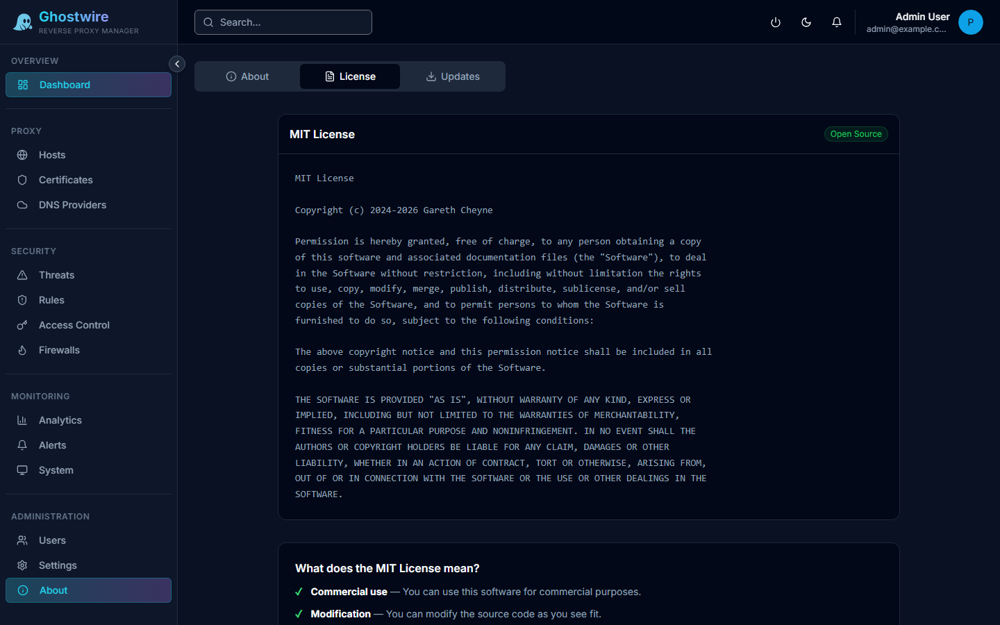

> Navigate to **Administration → About** to view version info, license, and updates.

The About page provides system information, licensing details, and update management in a tabbed interface.

## About Tab

Displays general information about your Ghostwire Proxy installation:

| Field | Description |
|-------|-------------|
| **Version** | Currently installed version |
| **Build Date** | When this version was built |
| **System Info** | Host system details |

## License Tab

View the project license and attribution details.

## Updates Tab

Check for new versions and apply updates. See [Updates](./updates.md) for full details.

