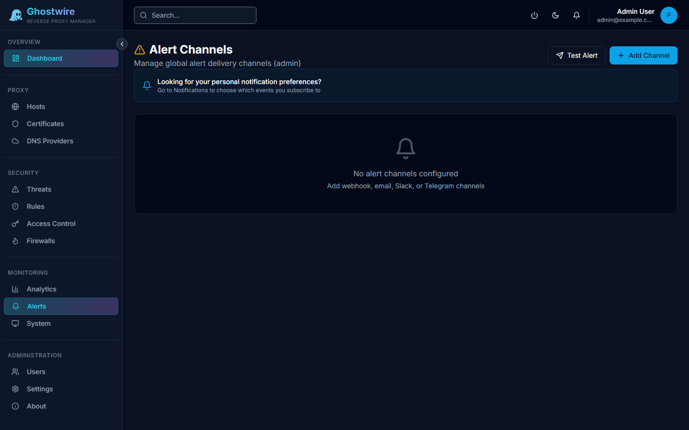

Alert channels define how security notifications are delivered outside the admin panel.

## Supported Channels

| Channel | Delivery |
|---------|----------|
| **Webhook** | HTTP POST to a custom URL |
| **Email** | SMTP email delivery |
| **Slack** | Message via Slack webhook |
| **Web Push** | Browser push notifications |

## Creating a Channel

| Field | Description |
|-------|-------------|
| **Name** | Channel name |
| **Type** | Webhook, email, Slack, or web push |
| **Endpoint** | URL or email address for delivery |
| **Enabled** | Toggle channel on/off |

### Webhook Configuration

Provide a URL that accepts HTTP POST requests. The request body contains a JSON payload with event details (type, summary, severity, timestamp, IP, and host).

### Email Configuration

Configure SMTP settings for email delivery:

- SMTP server hostname and port
- Authentication credentials
- TLS/SSL toggle
- Sender and recipient addresses

### Slack Configuration

Provide a Slack incoming webhook URL. Notifications are formatted as Slack message blocks with severity color coding.

### Web Push

Web push requires VAPID keys to be configured in your environment variables. Users can subscribe to push notifications directly in their browser.

## Testing Channels

Click the **Test** button on any channel to send a test notification and verify delivery.
