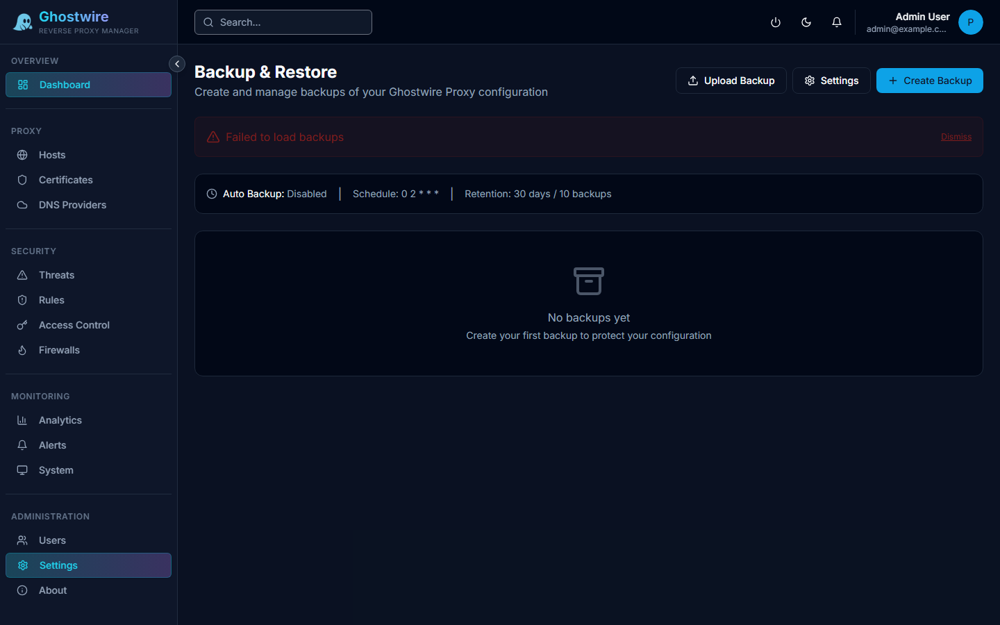

The backup system allows you to create snapshots of your configuration and restore them when needed.

## Creating a Backup

Click **Create Backup** to generate a snapshot that includes:

- All proxy host configurations
- SSL certificates and keys (encrypted)
- WAF rules and security settings
- Access lists, auth walls, and their users
- GeoIP rules and rate limit configurations
- Firewall connector settings (credentials encrypted)
- Alert channel configurations
- User accounts

## Backup History

The backup page shows a list of all available backups with:

| Column | Description |
|--------|-------------|
| **Date** | When the backup was created |
| **Size** | Backup file size |
| **Download** | Download the backup file |

## Restoring a Backup

Select a backup from the history and click **Restore** to restore all configuration from that snapshot.

> [!WARNING]
> Restoring a backup replaces your current configuration. Create a fresh backup before restoring an older one.

## Scheduled Backups

Configure automatic backups on a recurring schedule to ensure you always have a recent recovery point.
