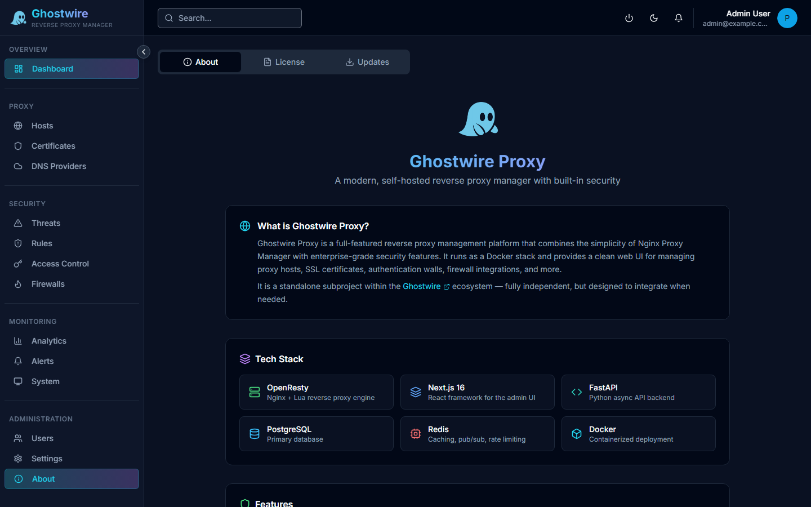

> Navigate to **Administration → About** and select the **Updates** tab.

The updates page lets you check for new versions and apply updates to your installation.

## Checking for Updates

Click **Check for Updates** to query the latest available version. The page displays:

| Field | Description |
|-------|-------------|
| **Current Version** | Your installed version |
| **Latest Version** | The newest available version |
| **Changelog** | What's new in the latest release |

## Applying Updates

When an update is available, click **Update** to pull the latest container images and restart services. The update process:

1. Pulls new Docker images
2. Restarts updated containers
3. Runs any required database migrations

> [!IMPORTANT]
> Create a [backup](./backups.md) before applying updates. While updates are designed to be non-destructive, having a recovery point is always recommended.

## Auto-Updates

Enable automatic updates to have Ghostwire Proxy check for and apply updates on a schedule.
