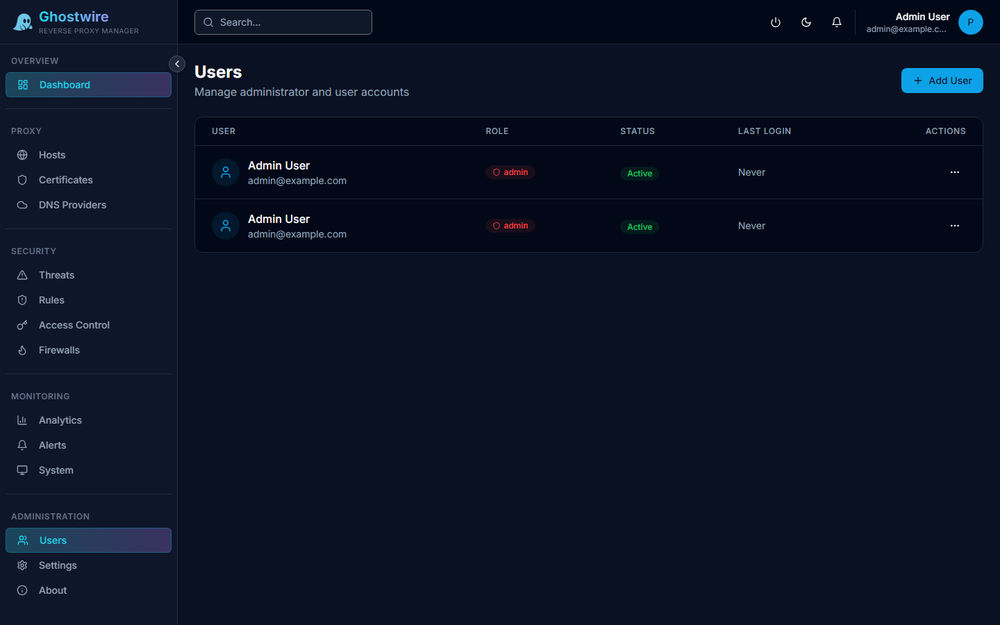

Ghostwire Proxy supports multiple admin users with role-based access control.

## User Roles

| Role | Permissions |
|------|------------|
| **Admin** | Full access — manage all settings, users, and security features |
| **User** | Manage proxy hosts, certificates, and view analytics |
| **Viewer** | Read-only access to all pages |

## Creating a User

Click **Add User** and provide:

| Field | Description |
|-------|-------------|
| **Email** | Login email address (must be unique) |
| **Name** | Display name |
| **Role** | Admin, User, or Viewer |
| **Password** | Auto-generated secure password or custom password |

> [!TIP]
> When a user is created with an auto-generated password, make sure to copy and share it securely. The password cannot be retrieved after creation — only reset.

## Managing Users

| Action | Description |
|--------|-------------|
| **Edit** | Change name, role, or reset password |
| **Disable** | Deactivate a user without deleting their account |
| **Delete** | Permanently remove the user |

## User Details

Each user record tracks:

- Email and display name
- Role assignment
- Active/inactive status
- Account creation date
- Last login timestamp
