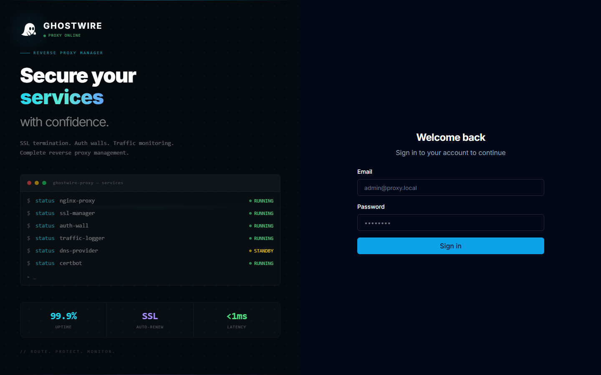

## Login Screen

When you first open the admin panel at `http://your-server-ip:88`, you'll see the login screen.

Enter the credentials for an admin user that was created during setup. If this is a fresh installation, you will need to create the first admin user through the API or a setup process.

## Dashboard Overview

After logging in, you'll land on the dashboard which shows a real-time overview of your proxy infrastructure.

## Dashboard Cards

The dashboard displays key metrics at a glance:

| Card | Description |
|------|-------------|
| **Total Requests** | Proxy requests over the last 24h, 7d, or 30d |
| **Unique Visitors** | Distinct client IPs in the selected period |
| **Bandwidth** | Total bytes transferred (requests + responses) |
| **Response Time** | Average response time with trend indicators |
| **Error Rate** | Percentage of 4xx/5xx responses |
| **WAF Blocks** | Requests blocked by the Web Application Firewall |
| **Threat Events** | Security events detected today and this week |
| **Auth Wall Errors** | Failed authentication attempts (401/403) |

## Service Health

The bottom of the dashboard shows live health status for:

- **Nginx** — Proxy server status
- **API** — Backend service status
- **Database** — PostgreSQL connection status

## Proxy Hosts Summary

The dashboard also lists your active proxy hosts and SSL certificates with their current status, making it easy to spot issues at a glance.

## Next Steps

From the dashboard, use the sidebar navigation to:

1. **[Add your first proxy host](../proxy-management/proxy-hosts.md)** — Start routing traffic
2. **[Set up SSL certificates](../proxy-management/certificates.md)** — Enable HTTPS
3. **[Enable the WAF](../security/waf.md)** — Protect your services
4. **[Configure alerts](../administration/alerts.md)** — Get notified of security events
