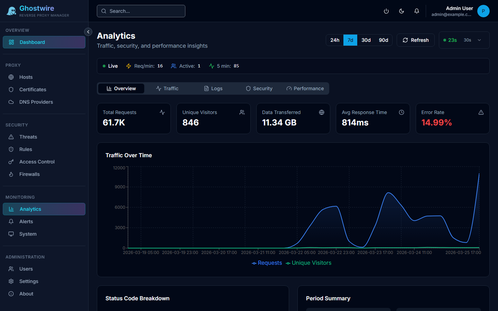

The analytics dashboard provides real-time visibility into your proxy traffic across four tabs: Overview, Traffic, Security, and Performance.

## Overview Tab

The overview tab shows aggregate metrics with time-range comparison:

| Metric | Description |
|--------|-------------|
| **Total Requests** | Request count for the selected period |
| **Unique Visitors** | Distinct client IPs |
| **Bytes Transferred** | Total bytes sent and received |
| **Average Response Time** | Mean response time with trend comparison |
| **Error Rate** | Percentage of 4xx and 5xx responses |

A time-series graph shows requests, visitors, bandwidth, and response time over hourly or daily buckets.

## Traffic Tab

Detailed traffic breakdowns:

- **Top Proxy Hosts** — Ranked by requests, visitors, or bandwidth
- **HTTP Methods** — Distribution of GET, POST, PUT, DELETE, etc.
- **Top Pages** — Most-requested URI paths
- **Top Referrers** — Sources of incoming traffic
- **Top Client IPs** — Most active clients with country info
- **Hourly Distribution** — Request volume by hour of day
- **Browser Stats** — Parsed from User-Agent headers
- **Country Breakdown** — Geographic distribution of requests

## Security Tab

Security-focused analytics:

- **Error Count** — Total 4xx and 5xx errors
- **Status Code Breakdown** — Distribution of 2xx, 3xx, 4xx, 5xx responses
- **Errors by Host** — Which proxy hosts have the most errors
- **Errors by Status Code** — Most common error codes

### Threat Origin Heatmap

The security tab includes a geographic heatmap showing where threat events originate from. The heatmap uses GeoIP data to plot threat sources on a world map, making it easy to identify geographic patterns in attack traffic.

## Performance Tab

Response time analysis:

- **Percentiles** — p50, p95, and p99 response times
- **Slowest Pages** — URI paths with highest response times
- **Slowest Hosts** — Proxy hosts with highest response times
- **Slow Requests Table** — Detailed list of the slowest individual requests

## Time Range

All analytics support configurable time ranges. Use the period selector to view data for the last 24 hours, 7 days, or 30 days.
