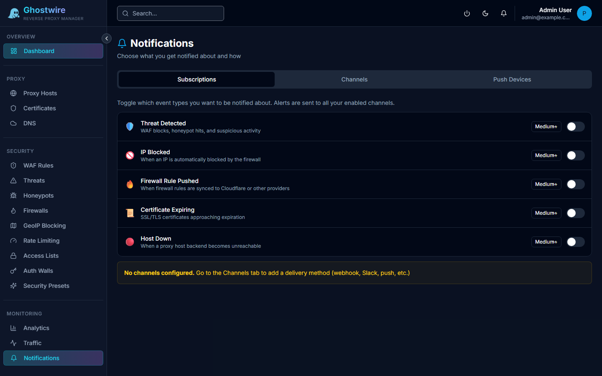

The notifications page shows a feed of recent security alerts and system events.

## Event Types

Notifications are generated by:

- **Threat events** — WAF blocks, honeypot triggers, threat score escalations
- **Rate limit violations** — IPs exceeding configured thresholds
- **Authentication failures** — Failed auth wall login attempts
- **Certificate expiry** — SSL certificates approaching expiration
- **System alerts** — Service health changes, high resource usage

## Notification Feed

Each notification displays:

| Field | Description |
|-------|-------------|
| **Event Type** | Category of the event |
| **Summary** | Brief description of what happened |
| **Timestamp** | When the event occurred |
| **Associated IP/Host** | Related IP address or proxy host |
| **Severity** | Event severity level |

## Actions

- **Acknowledge** — Mark a notification as reviewed
- **Dismiss** — Remove a notification from the feed

## Alert Channels

To receive notifications outside the admin panel (email, Slack, webhook), configure [Alert Channels](../administration/alerts.md).
