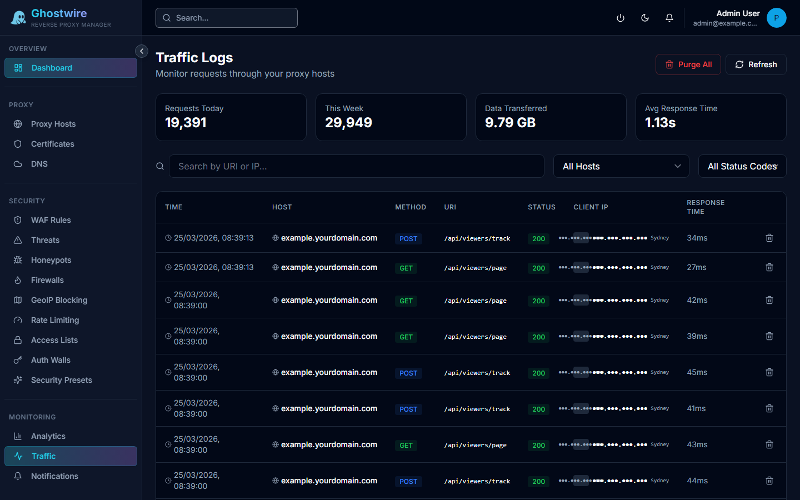

The traffic log provides a detailed view of every proxy request, including timing, headers, upstream details, and security context.

## Log Columns

| Column | Description |
|--------|-------------|
| **Timestamp** | When the request was received |
| **Proxy Host** | Which proxy host handled the request |
| **Method** | HTTP method (GET, POST, etc.) |
| **URI** | Request path |
| **Query String** | URL parameters |
| **Status Code** | HTTP response code |
| **Response Time** | Time to serve the response |
| **Client IP** | Client IP address with GeoIP country |
| **User-Agent** | Client User-Agent string |
| **Referer** | Referrer URL |
| **Bytes Sent/Received** | Data transferred in each direction |
| **Upstream Server** | Which backend server handled the request |
| **SSL Protocol/Cipher** | TLS details (for HTTPS requests) |
| **Authenticated User** | Auth wall user (if applicable) |

## Filtering

Use the filter controls to narrow the log view:

| Filter | Description |
|--------|-------------|
| **Host** | Filter by proxy host |
| **IP Address** | Filter by client IP |
| **Status Range** | Filter by status code (e.g., 4xx, 5xx) |
| **Date Range** | Filter by time period |
| **Limit** | Number of log entries to display |

## Log Retention

Traffic logs are retained for a configurable number of days. Older entries are automatically purged. Configure retention in [Settings](../administration/settings.md).

> [!NOTE]
> Per-host traffic logging can be enabled or disabled individually on each proxy host. Disabling logging for high-traffic hosts can reduce database growth.
