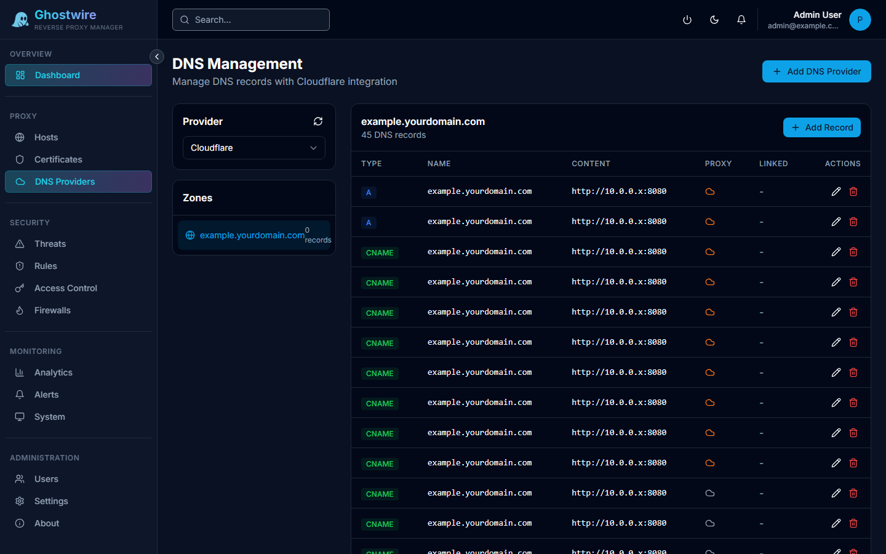

DNS providers enable DNS challenge validation for Let's Encrypt certificates. This is required for wildcard certificates and useful when port 80 is not reachable from the internet.

## Supported Providers

| Provider | Auth Method |
|----------|-------------|
| **Cloudflare** | API Token |

## Adding a Cloudflare DNS Provider

:::steps
### Navigate to DNS Providers

Open the DNS page from the sidebar navigation.

### Click "Add DNS Provider"

Select Cloudflare as the provider type.

### Enter your API token

Create a Cloudflare API token with the following permissions:
- **Zone > DNS > Edit** — for the zones you want to manage
- **Zone > Zone > Read** — to list available zones

### Select zones

After saving the token, Ghostwire Proxy fetches your available Cloudflare zones. Select the zones (domains) you want to use for DNS challenges.

### Test connectivity

Click the **Test** button to verify API access before saving.
:::

## DNS Zone Management

Once a provider is configured, the DNS page shows:

- **Zone list** — All configured domains with their provider
- **DNS records** — View records within each zone
- **Record management** — Create, edit, and delete DNS records

> [!NOTE]
> DNS record management is primarily used for certificate validation. For day-to-day DNS management, use your DNS provider's native interface.

## Using DNS Challenge

When requesting a Let's Encrypt certificate, select **DNS Challenge** as the validation method and choose the DNS provider. Ghostwire Proxy will automatically create and clean up the required TXT records via the Cloudflare API.
