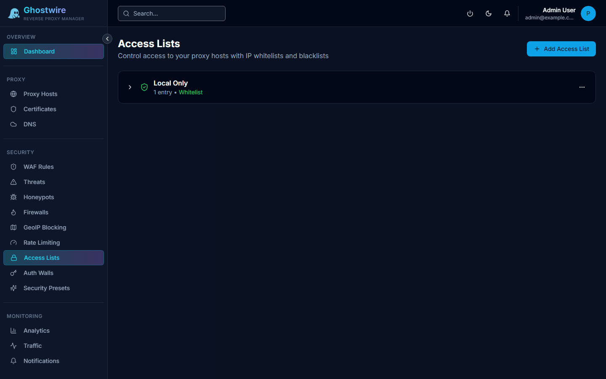

Access lists allow you to control which IP addresses can reach your proxy hosts. Create reusable lists and assign them to one or more proxy hosts.

## How It Works

Access lists are evaluated at the access phase, before authentication walls or WAF rules. This makes them the first line of defense for IP-based filtering.

- **Whitelist mode** — Only IPs in the list can access the service. All others are rejected.
- **Blacklist mode** — IPs in the list are blocked. All others are allowed.

## Creating an Access List

| Field | Description |
|-------|-------------|
| **Name** | Descriptive list name |
| **Description** | Notes about this list's purpose |
| **Mode** | `whitelist` or `blacklist` |
| **Default Action** | What to do if the IP is not in the list (`allow` or `deny`) |

## Managing Entries

Each entry in an access list specifies:

| Field | Description |
|-------|-------------|
| **IP / CIDR** | Single IP address or CIDR range (e.g., `192.168.1.0/24`) |
| **Comment** | Reason or note for this entry |
| **Enabled** | Toggle entry on/off without removing it |

> [!TIP]
> Use CIDR notation to match entire subnets. For example, `10.0.0.0/8` matches all IPs in the 10.x.x.x range.

## Assigning to Proxy Hosts

After creating an access list, assign it to a proxy host in the proxy host's configuration. Each proxy host can have one access list assigned.

## Common Use Cases

### Office-only access

Create a whitelist with your office IP ranges. Assign it to internal services that should only be accessible from the office network.

### Known bad actors

Create a blacklist with IPs you want to block immediately, without waiting for the threat response system to escalate them.

### VPN-only services

Create a whitelist containing only your VPN exit IPs to restrict access to VPN users.
