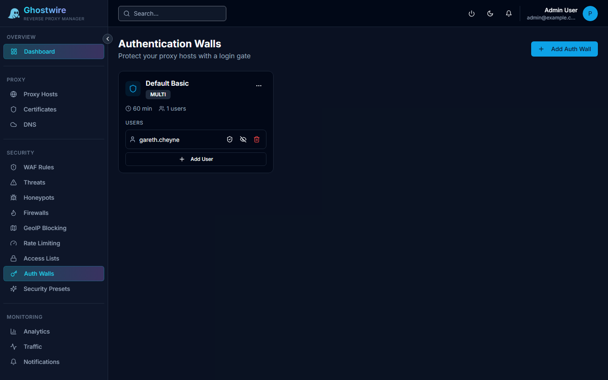

Authentication walls add a login requirement to any proxy host. Users must authenticate before accessing the upstream service. Multiple authentication methods are supported including local accounts, LDAP, and OAuth2.

## How It Works

When an auth wall is assigned to a proxy host, every request is intercepted in OpenResty's `access_by_lua` phase:

1. Check for a valid session cookie (`gw_auth_session`)
2. Verify the cookie signature using HMAC-SHA256
3. If valid, the request passes through to the upstream
4. If invalid or missing, redirect to the login portal

Session verification uses a local 30-second cache to reduce backend API calls.

## Creating an Auth Wall

| Field | Description |
|-------|-------------|
| **Name** | Auth wall name |
| **Description** | Notes about this wall |
| **Auth Type** | `local`, `LDAP`, `OAuth2`, or `multi-method` |
| **Session Timeout** | How long a session remains valid (default: 1 hour) |
| **Custom Branding** | Optional login portal customization (logo, colors, text) |
| **Enabled** | Toggle on/off |

## Authentication Methods

### Local Authentication

Create username/password accounts specific to this auth wall.

| Field | Description |
|-------|-------------|
| **Username** | Login username |
| **Password** | Password (hashed with bcrypt) |
| **Email** | User email address |
| **Display Name** | User's display name |
| **Enabled** | Toggle user on/off |

### LDAP Authentication

Connect to an LDAP directory (Active Directory, OpenLDAP):

| Field | Description |
|-------|-------------|
| **Host** | LDAP server hostname |
| **Port** | LDAP port (389 or 636 for SSL) |
| **SSL / STARTTLS** | Connection encryption |
| **Bind DN** | Distinguished name for binding |
| **Bind Password** | Bind password (encrypted at rest) |
| **Base DN** | Search base for user lookups |
| **User Filter** | LDAP filter for user matching |
| **Attribute Mappings** | Map LDAP attributes to username, email, display name |

### OAuth2 / SSO

Add OAuth2 providers for single sign-on:

| Field | Description |
|-------|-------------|
| **Provider Name** | Display name (e.g., "Google", "GitHub") |
| **Provider Type** | `Google`, `GitHub`, or `Custom` |
| **Client ID** | OAuth2 client ID |
| **Client Secret** | OAuth2 client secret (encrypted at rest) |
| **Auth URL** | Authorization endpoint |
| **Token URL** | Token exchange endpoint |
| **Userinfo URL** | User profile endpoint |
| **Scopes** | Requested scopes (e.g., `email profile`) |

## TOTP Two-Factor Authentication

Auth wall users can enable TOTP (Time-based One-Time Password) for two-factor authentication. After enabling TOTP, users must enter a 6-digit code from their authenticator app in addition to their password.

## Login Portal

The auth wall login portal is a separate Vite + React single-page application that supports:

- Local username/password login
- LDAP authentication
- OAuth2 redirect flows
- TOTP verification
- Custom branding (logo, colors, text)

Portal paths (`/__auth/`, `/api/auth-portal/`) are excluded from authentication to prevent redirect loops.

## Active Sessions

View and manage active auth wall sessions from the sessions tab. Each session shows:

- Username, IP address, and login timestamp
- Session expiry time
- Manual revocation option

## Assigning to Proxy Hosts

After creating an auth wall, assign it to a proxy host in the host's configuration. When assigned, all requests to that host require authentication before reaching the upstream service.
