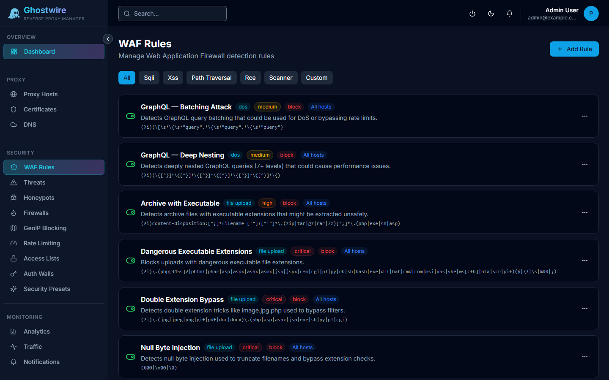

Ghostwire Proxy includes a comprehensive security stack that operates at the proxy layer. All security features are implemented in Lua and execute inside OpenResty before requests reach your upstream services.

## In This Section

- [Web Application Firewall](./waf.md) — Regex-based request filtering for SQLi, XSS, and more
- [Threat Response](./threats.md) — Automated IP scoring with tiered escalation
- [Firewall Integration](./firewalls.md) — Push blocked IPs to UniFi or MikroTik network firewalls
- [GeoIP Blocking](./geoip.md) — Country-level allow/deny lists
- [Honeypot Traps](./honeypot.md) — Detect attackers scanning for common paths
- [Rate Limiting](./rate-limits.md) — Per-host request throttling
- [Access Lists](./access-lists.md) — IP whitelists and blacklists
- [Authentication Walls](./auth-walls.md) — Protect services behind login gates
- [Security Presets](./presets.md) — One-click best-practice configurations
