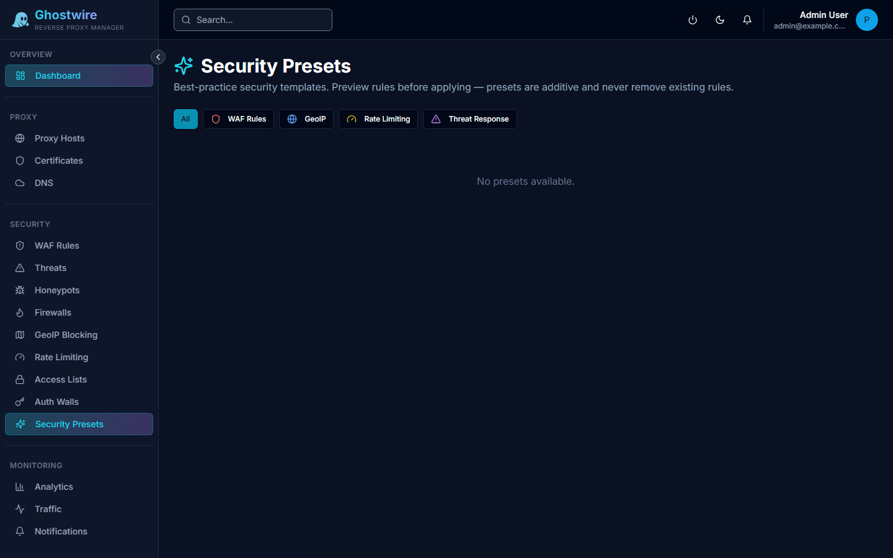

Security presets provide curated bundles of security rules that can be applied with a single click. They configure WAF rules, GeoIP blocking, rate limiting, and threat response policies based on proven best practices.

## How It Works

Each preset is a JSON template containing a set of security rules. When you apply a preset, Ghostwire Proxy creates the rules defined in the template. Presets are additive — they create new rules but never modify or remove existing ones.

## Preset Categories

| Category | Examples |
|----------|---------|
| **WAF Rules** | OWASP Core Rule Set, SQLi/XSS protection, scanner blocking |
| **GeoIP Rules** | Block high-risk countries, allow domestic only |
| **Rate Limits** | Aggressive, moderate, or lenient throttling profiles |
| **Threat Response** | Zero tolerance, permissive, or balanced policies |

## Operations

| Action | Description |
|--------|-------------|
| **View** | Inspect the rules a preset will create before applying |
| **Apply** | Create all rules defined in the preset |
| **Remove** | Delete all rules that were created by this preset |
| **Reapply** | Remove then re-create from the latest template version |

## Scope

Presets can be applied globally or scoped to a specific proxy host (for GeoIP and rate limit rules). WAF rule presets always apply based on each rule's configured scope.

> [!TIP]
> Apply the OWASP Core Rule Set preset as a starting point for WAF protection. You can then customize individual rules by editing them after the preset is applied.

## Audit Trail

All preset operations (apply, remove, reapply) are logged in the admin audit trail, including which user performed the action and when.
